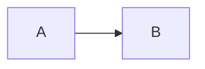

I'm mostly curious how the whole footnotes^[This is the part that gets added below] thing goes.

If I write additional[^extra] notes in a separate paragraph then I can [^1] reference them below. What happens if I don't respect the auto-numbering?

If I go on to add add'l references to existing footnotes, what happens then?[^1][^extra]

Areas of interest:

- Check out the starting flow chart for [dose-calc](../dose-calc){.project .mine} {.link-list-item}
- New ideas go to [inbox](../inbox) {.link-list-item}

+++ I wonder how much text I can put on this line before it becomes problematic
This is the part where I put the information that isn't revealed immediately
+++

this
: works
: mostly

## TODO

> - Fix CSS for definition lists
> - and block-quotes
> - and probably block-quote lists



## *Italic* **bold** ***both*** none

*italic* **bold** ***both*** none

``` {style="font-style:italic;"}
italic
```

``` {style="font-weight:bold;"}
bold
```

``` {style="font-style:italic;font-weight:bold;"}
bold italic
```

``` {tabindex}
none
```

```ts
//monocomment

/** doc comment
 * multiline magic in editor
 * aligns text and gives pretty margin
 */

/* multiline magic doesn't happen
in regular multiline comments */

function makeBeer({yeast, grains, water, time}: BeerRecipe): beer {
  return yeast + ...grains + water * time;
}

interface BeerRecipe {
  yeast: Yeast;
  grains: Grain[];
  water: number;
  time: number;
}

interface Yeast {
  species: string;
  quantity: number;
}

interface Grain {
  species: string;
  quantity: number;
}
```

*[add'l]: additional

[^extra]: this footnote is a bit extra
[^1]: This is the first footnote I numbered.
