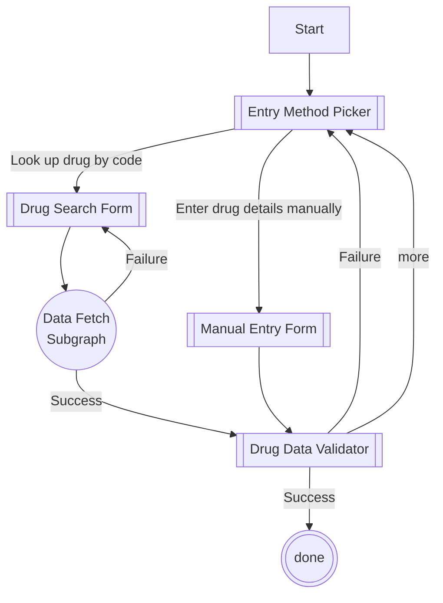

## Scratch your own itch

Every day I calculate anesthetic doses for dogs and cats. More precisely, every day I enter a few pieces of patient data into a spreadsheet and let Excel suggest anesthetic doses for dogs and cats. There will always be an element of human judgment involved, but calculating the baseline doses is much easier for a computer than it is for me at <time datetime="07:30">7:30 in the morning</time>. The spreadsheet I made calculates typical doses for every anesthetic and emergency drug that we have available. It's fine, but I think I can do better.

## Getting the data

The FDA has a set of API for getting data about drugs. Most of the anesthetics we use in veterinary medicine are labeled for human use, so they are available via the [openFDA NDC API](https://open.fda.gov/apis/drug/ndc/). NDC for veterinary-only products aren't available via the API, so I'll provide a means to enter the data manually if it isn't already available. In the future, I would like to offer search by additional fields, like active ingredient or trade name, but the FDA API provides the quickest path to a working prototype.

For each drug saved, I will have to provide a list of doses that are typically used in my facility. This can be provided at any time, but storing it in advance will allow the output to have sane defaults. The anesthetic plan builder will also provide a means to override and provide arbitrary dosing while offering a warning if the entered dose is outside of the expected range.

## Keeping the data

I don't want to implement backend authentication and storage for this project, so I'll rely on [localStorage](https://developer.mozilla.org/en-US/docs/Web/API/Window/localStorage "localStorage documentation on MDN") to hold drug data during the process and between sessions. I will need a way to restore data, possibly by providing a downloadable serialization of the user data or by a magic bookmark. The data needs to be persistent; I don't want to re-enter all my pharmacy data every time I have a new patient.

This is all part of the `saveData` state from the chart above.

## Using the data

After the data for each drug in the pharmacy is saved, I need to build the anesthetic plan. The only piece of patient data that the computer needs is the patient's weight. Everything else I'll ask for is for reference and record-keeping. The interface will allow the selection of any of the stored drugs, calculate the weight-based dose, and present a summary of the plan in a printable format.

First, select which drugs to use from the previously saved information.

Then enter patient data and receive calculated dosing for the selected drugs, an IV fluid rate, and other nifty things. I've provided space for recording information required for the medical record. This tool can be used to calculate a plan or generate a baseline that a qualified individual can tweak to the individual patient's needs.

The project is already started on GitHub at <http://hiimmrdave.github.io/dosing>. I'll write more about my planning and implementation as I work through it.

*[NDC]: National Drug Code
*[FDA]: United States Food and Drug Administration
*[API]: Application Programming Interface
