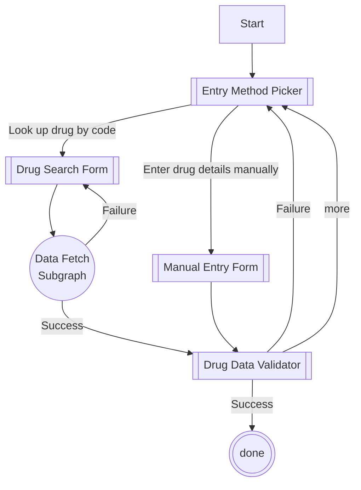

<!--TODO: retired page tag/front-matter key? draft: true to hide for now.-->

```mermaid
flowchart TB
  Start-->methodPick
  methodPick[[Entry Method Picker]]
  methodPick--Enter drug details manually-->manualEntry
  manualEntry[[Manual Entry Form]]
  methodPick--Look up drug by code-->APILookup
  APILookup[[Drug Search Form]]
  APILookup-->APIFetch
  APIFetch((Data Fetch\nSubgraph))
  APIFetch--Success-->drugValidate
  APIFetch--Failure-->APILookup
  manualEntry-->drugValidate
  drugValidate[[Drug Data Validator]]
  drugValidate--Success-->done
  drugValidate--Failure-->methodPick
  drugValidate--more-->methodPick
  done(((done)))
```
